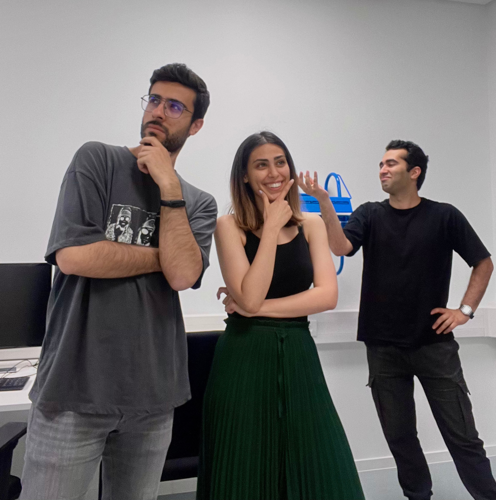

Here's the translated text from your document:

# ICG Project by Group < Amoo >
<!-- An image of the application must be located in the ./img folder relative to this file -->


   
<div align="center">
    
</div>

This repository contains the project for the course "Interactive Computer Graphics" by < Soroush Keyvani, Mahta Moosavi, and Ehsan Vahidifar >.

# Project Structure

**You can describe the project structure as you like. Here simply with the Unix program `tree`**

```
.
├── README.md
├── dist
│   ├── index.html
│   ├── src
│   └── textures <-- Textures
├── ...
├── img <-- Documentation
│   └── screenshot.png
├── obj <-- OBJ files
├── src
│   ├── abgabe.ts <-- Boilerplate
│   ├── ...
│   ├── loader  <-- shader loader
│   ├── math <-- Math library
│   ├── parser <-- OBJ Parser
│   ├── renderers
│   ├── saveload.ts <-- Load / Save
│   └── scene  <-- Scene graph
│       ├── ...
│       ├── camera.ts
│       ├── ...
│       ├── interaction.ts
│       ├── sceneUtils.ts
│       └── visitors <-- Visitors
└── ...

```

- add a brief description of the project structure

# Dependencies

List all dependencies of your project here. You can use the following template:

| Dependency                                                                                     | Version     | Description                                                                               |
| ---------------------------------------------------------------------------------------------- | ----------- | ----------------------------------------------------------------------------------------- |
| [Unity](https://unity.com/)                                                                    | 2021.3.11f1 | Unity is a cross-platform game engine developed by Unity Technologies.                    |
| [Ink Painter](https://assetstore.unity.com/packages/tools/particles-effects/ink-painter-86210) | nv1.2.1     | Ink Painter is a tool for Unity that allows you to paint on 3D objects in the scene view. |
| ...                                                                                            | ...         | ...                                                                                       |

# Build and Installation

**Describe how to build and install process of the application. If the development process needs to download additional files, you can describe it here.  Assets uploaded alongside the project do not need further explanation. (Remember to adhere to the EULA of the asset regarding redistribution.)**

# Execution

**Describe how to execute the application.**

# How-To

**Add a brief description of how to use the application. You can also add screenshots or videos to illustrate the usage.**


# Requirements


<!-- replace  "- [ ]" with "- [X]" when you tackled the topic -->
<!-- the bullet points are from last years requirements; you need to change the entries to reflect the current requirements -->

| ID    | Points | Description                                                                                                                                                                                                                    | bearbeitet               | responsible              |
| ----- | ------ | ------------------------------------------------------------------------------------------------------------------------------------------------------------------------------------------------------------------------------ | ------------------------ | ------------------------ |
| M1    | 5      | Materials relevant to grading, such as code, a final build, documentation, videos, images, etc., shall be uploaded to GitLab projects                                                                                          | <ul><li>- [ ] </li></ul> | Daisy Duck               |
|       |        | within the team's assigned GitLab group **no later than 22.09.2024, 23:59**. **Note**: Any resources uploaded to external platforms will not be considered for grading.                                                        |                          |                          |
| M2    | 10     | The GitLab project’s **Readme.md** shall include a list of all requirements considered for grading .                                                                                                                           | <ul><li>- [ ] </li></ul> | Gustav Gans              |
| M3    | 3      | All optional requirements to be considered, as well as $M6$-$M9$, shall include a brief textual description of the implementation                                                                                              | <ul><li>- [ ] </li></ul> | Kater Karlo              |
|       |        | on the project's GitLab wiki, including how the implementation can be showcased. **Note**: External packages, libraries, and plugins used must be clearly indicated.                                                           |                          |                          |
| M4    | 8      | A short (2-4 min) video showcasing the application shall be uploaded to the GitLab project using the HCI chair’s video template. The video must be encoded in mp4 format using MPEG-4 codec and accompanied by a teaser image. | <ul><li>- [ ] </li></ul> | Daisy Duck, Kater Karlo  |
| M5    | 4      | The application shall be set up on a workstation in E37 and runnable without modifications.                                                                                                                                    | <ul><li>- [ ] </li></ul> | Gustav Gans              |
| M6    | 5      | Implementation of a interactive desktop 3D application using the Unity game engine. Users shall be able to create and switch between humanoid characters, with one detailed character displayed at a time.                     | <ul><li>- [ ] </li></ul> | Kater Karlo              |
| M7    | 4      | The user shall be able to change the material properties of the selected character interactively through a user interface.                                                                                                     | <ul><li>- [ ] </li></ul> | Daisy Duck               |
| M8    | 2      | The user shall be able to change the pose of the selected character using the built-in Unity Animation System.                                                                                                                 | <ul><li>- [ ] </li></ul> | Gustav Gans              |
| M9    | 4      | Character selection and customizations shall be saveable persistently and restorable.                                                                                                                                          | <ul><li>- [ ] </li></ul> | Daisy Duck, Gustav Gans  |
| M10   | 5      | A 2D screen space UI must be provided, enabling the user to customize material properties of body parts and support saving/loading of customizations.                                                                          | <ul><li>- [ ] </li></ul> | Kater Karlo              |
|       |        |                                                                                                                                                                                                                                |                          |                          |
| O1_C  | 10     | The user shall be able to apply colors, textures or materials directly to the surface of the selected character using drag and drop.                                                                                           | <ul><li>- [ ] </li></ul> | Daisy Duck               |
| O1_E1 | 5      | The 2D UI shall be extended to facilitate the selection of colors and pencil shapes.                                                                                                                                           | <ul><li>- [ ] </li></ul> | Gustav Gans              |
| O2_C  | 5      | The prototype shall use the URP and at least one simple URP shader shall be applied to one object.                                                                                                                             | <ul><li>- [ ] </li></ul> | Kater Karlo              |
| O2_E1 | 5      | The prototype's visual presentation shall feature at least one post-processing effect like Color Grading or Depth of Field.                                                                                                    | <ul><li>- [ ] </li></ul> | Daisy Duck               |
| O2_E2 | 10     | An animated highlighting effect shall be applied on objects the user hovers over, implemented by a custom shader.                                                                                                              | <ul><li>- [ ] </li></ul> | Gustav Gans, Kater Karlo |
| O3_C  | 5      | The prototype shall use rigged 3D models instead of static meshes.                                                                                                                                                             | <ul><li>- [ ] </li></ul> | Daisy Duck               |
| O3_E1 | 5      | The user shall be able to select and play clips that animate the pose of the selected character.                                                                                                                               | <ul><li>- [ ] </li></ul> | Gustav Gans              |
| O3_E2 | 5      | The user shall be able to modify individual features of the character's pose via the 2D user interface.                                                                                                                        | <ul><li>- [ ] </li></ul> | Kater Karlo              |
| O3_E3 | 5      | The user shall be able to modify individual features of the character's facial expression via the 2D user interface.                                                                                                           | <ul><li>- [ ] </li></ul> | Daisy Duck, Gustav Gans  |
| O3_E4 | 10     | The user shall be able to select and play clips that animate the facial expression of the selected character.                                                                                                                  | <ul><li>- [ ] </li></ul> | Kater Karlo              |
| O3_E5 | 10     | The user shall be able to export a static model of the current pose and/or facial expression to a file that can be imported into Blender.                                                                                      | <ul><li>- [ ] </li></ul> | Daisy Duck               |
| O4_C  | 5      | The user shall be able to import and apply custom 3D models to the selected character.                                                                                                                                         | <ul><li>- [ ] </li></ul> | Gustav Gans              |
| O4_E1 | 5      | The user shall be able to add 3D models to predefined positions on the selected character.                                                                                                                                     | <ul><li>- [ ] </li></ul> | Kater Karlo              |
| O4_E2 | 10     | The user shall be able to swap body parts of the selected character with custom 3D models.                                                                                                                                     | <ul><li>- [ ] </li></ul> | Daisy Duck, Gustav Gans  |
| O5    | 5      | The user shall be able to move the camera continuously around the selected character by click and dragging.                                                                                                                    | <ul><li>- [ ] </li></ul> | Kater Karlo              |
| O6_C  | 5      | The 2D UI implementation shall use Unity Style Sheets (USS) including transitions to make it visually appealing.                                                                                                               | <ul><li>- [ ] </li></ul> | Daisy Duck               |
| O6_E1 | 10     | Usage of an in-game tutorial in place of a video tutorial. Animations for the 2D UI as well as other optional requirements shall be used to guide the user through the application. This supersedes $M4$.                      | <ul><li>- [ ] </li></ul> | Gustav Gans, Kater Karlo |
